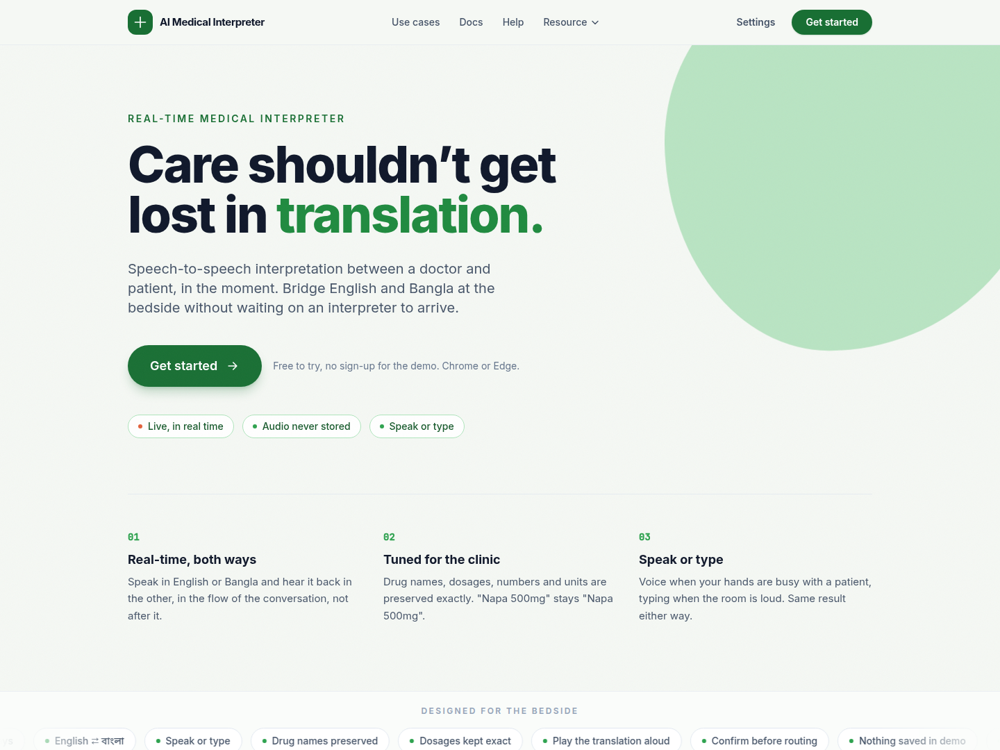
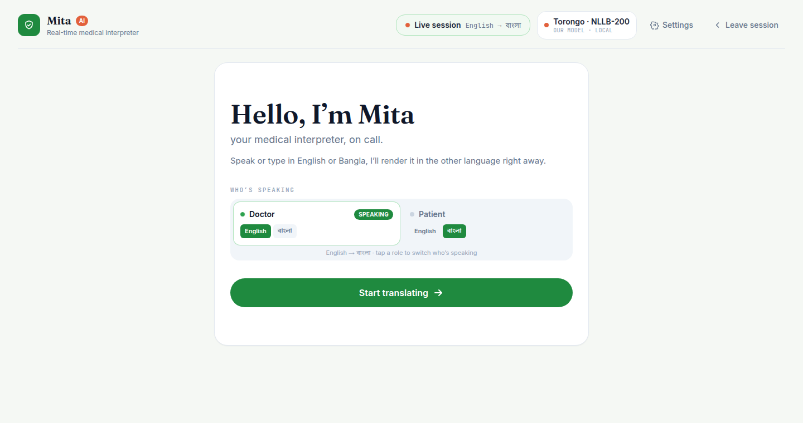
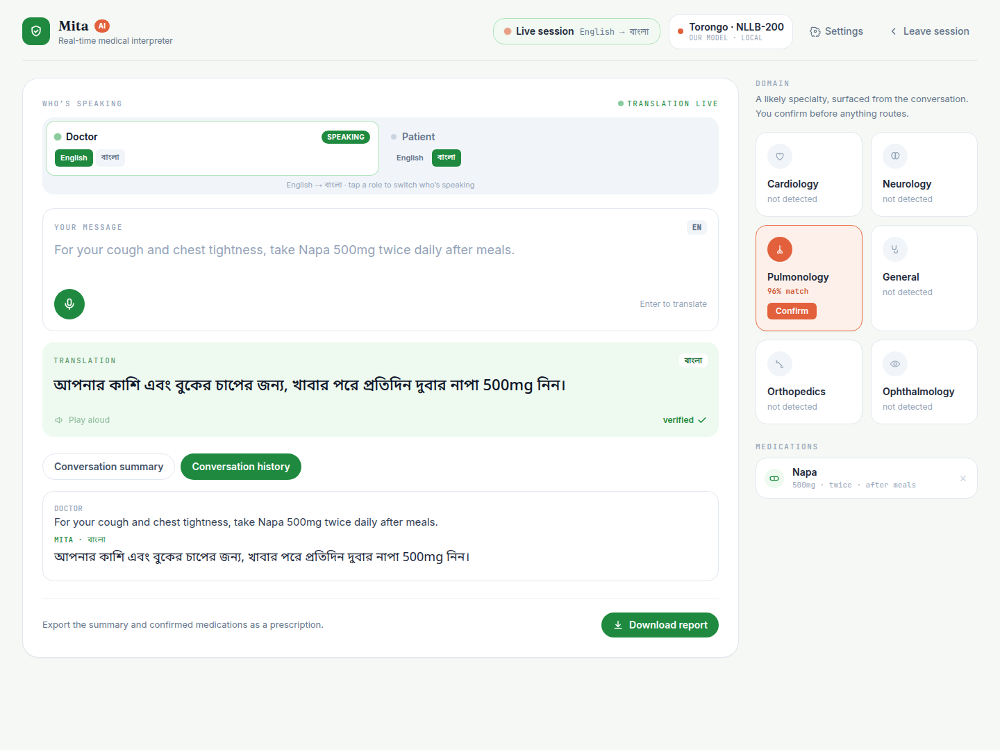
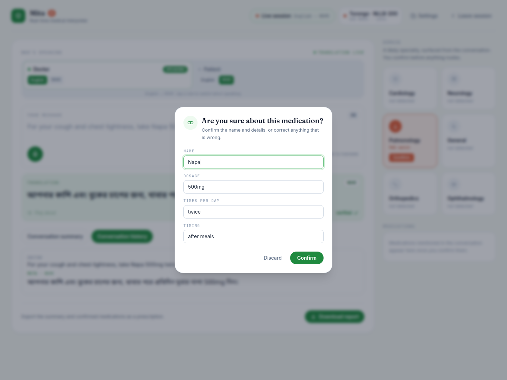

# AI Medical Interpreter (Mita)

**A real-time, speech-to-speech interpreter that translates a clinical conversation between a doctor and a patient across English and Bangla.** The user speaks or types in one language and gets the meaning in the other almost immediately, as both text and speech, with clinical terms preserved and doubtful output flagged rather than hidden.

Course project for **CSE309 Software Engineering**, Independent University, Bangladesh (IUB).
By **Syed Mehedi Hussain** and **Md Sakib Al Hasan**. Called *Mita* inside the app.



> This README is the engineering companion to the full [Software Requirements Specification](#documentation). It describes the system as built.

---

## Contents

- [What it is](#what-it-is)
- [Two builds](#two-builds)
- [The console](#the-console)
- [Features](#features)
- [How one turn flows](#how-one-turn-flows)
- [Architecture](#architecture)
- [Translation engines](#translation-engines)
- [Getting started](#getting-started)
- [Environment variables](#environment-variables)
- [Safety and privacy](#safety-and-privacy)
- [Requirements](#requirements)
- [Known limitations](#known-limitations)
- [Tech stack](#tech-stack)
- [Project layout](#project-layout)
- [Documentation](#documentation)
- [Glossary](#glossary)

---

## What it is

The AI Medical Interpreter removes the language barrier between a doctor and a Bangla-speaking patient in real time, at the bedside, without waiting for a human interpreter.

The goals we kept coming back to were:

- **Faster, clearer clinical communication** — translation in near real time, both spoken and written.
- **Safety** — critical terms (drug names, dosages, numbers, units) are preserved, and the clinician stays in control; doubtful output is flagged, never silently trusted.
- **Privacy** — the system stores nothing. No audio is kept and no transcript is persisted on the server.
- **A team-built translation model** offered alongside a commercial cloud model, as our own academic objective.

It does **not** diagnose anything and does not keep long-term records of consultations. It translates only.

---

## Two builds

We built and demoed two working copies of this system over the semester, both on the same architecture:

| Build | Where it runs | Default engine | Extra features |
|---|---|---|---|
| **Deployed** | Frontend on Vercel, backend on Render | Google (cloud) | The core interpreter |
| **Local demo** | Both halves on a development machine | **Torongo**, our own fine-tuned model | Medication-safety check, medical-domain suggestion, consultation summary and prescription export |

The screenshots and the feature list below reflect the **local demo build**, since that is the version presented for evaluation. Where the deployed build is simpler, it is called out.

---

## The console

After entering the interpreter, Mita opens on a welcome panel where you set who is speaking and in which language:



Once a session starts, the layout becomes a focused clinical console: the live interpreter in the centre, with a **medical-domain** panel and a **medications** list in the right rail. Below, a doctor speaks an English sentence containing a drug and dosage; Mita renders it in Bangla with `Napa 500mg` preserved exactly, marks it **verified**, surfaces **Pulmonology** as the likely specialty (for the clinician to confirm), and lists the mentioned medication:



Medications mentioned in the conversation are extracted and shown for the doctor or patient to verify before they count — nothing is assumed:



---

## Features

At a high level, the product lets a user:

- **Choose the translation direction** — English or Bangla as the spoken language, swappable at any time by tapping a role.
- **Speak or type** an utterance — voice and typing are equal paths, not a primary and a fallback.
- **Receive the translation as text and speech**, in near real time, with an option to turn auto-play off.
- **Switch the translation engine** at run time — the cloud model or our own model.
- **See a likely medical domain** suggested from the conversation and confirm it before it is used.
- **Verify medications** the conversation mentions, then export them and a summary as a prescription.
- **Review a session transcript** that stays on the device and clears on refresh.
- **See a clear warning** when a translation looks doubtful or a service fails, with a retry where appropriate.

Optionally, with Supabase configured, a signed-in clinician can **save consultations** to their account. Guests can use everything except saving.

---

## How one turn flows

The core use case — *translate spoken speech* — runs like this:

1. The clinician taps the microphone and speaks in the source language. Mita shows a live "listening" state and streams the recognised words as they form.
2. The clinician stops. Mita finalises the text and sends it to the active engine.
3. Mita shows a "translating" state, then displays the translation as text and, if auto-play is on, speaks it in the target language.
4. The exchange is recorded in the on-device history. If the output is doubtful, it is marked **needs review**.

Typing follows the same path. If recognition returns nothing, Mita prompts you to try again or type. If an engine times out or is unavailable, Mita shows a clear message (timeout, rate limit, or unreachable) and offers **Retry**, or you switch engine.

**Business rule that holds across every path:** drug names, dosages, numbers, and units must appear unchanged in the output.

---

## Architecture

Mita is a two-part web system: a **browser frontend** and a **backend translation service**. The backend never translates directly — it delegates to a translation provider sitting behind a single interface, so the engine underneath can change without touching the rest of the system.

```
Browser (UI · speech recognition · speech output)
        │  HTTPS + JSON
        ▼
Backend API (FastAPI)
        │
        ▼
TranslationProvider interface  ──►  { Gemini cloud model | Torongo (our model) }
```

**Data flow for one turn:** microphone or keyboard → recognised or typed text → translate request → chosen engine → translated text → safety check → shown and spoken, then appended to the on-device session.

### The provider seam

The whole system is built around the `TranslationProvider` protocol (`backend/app/services/base.py`, selected in `registry.py`). Routers ask for a provider and receive something satisfying the protocol; they never learn which one. **Adding an engine is one new file plus one line in the registry — no router, model, or frontend change.** That is exactly what made Torongo a drop-in alongside the cloud model.

### Domain model

- **Session** — an in-memory, device-local conversation. Holds many Turns. Never persisted.
- **Turn** — one exchange: source text and language, translated text and language, input mode (voice or typed), a timestamp, and safety flags.
- **Language** — an internal code (`en`, `bn`) with display and speech attributes.
- **TranslationProvider** — an engine that, given text and a language pair, returns a translated result.
- **Domain** — a medical-specialty hint (Pulmonology, for example) derived from a Turn's text, which the clinician confirms before it is used.

A Session has many Turns; each Turn is produced by exactly one provider and belongs to one language pair; a Turn may raise one Domain hint.

Speech recognition uses the browser's Web Speech API; spoken output uses the browser's voices, with a server-side fallback for machines that lack a Bangla voice.

---

## Translation engines

Set `TRANSLATION_PROVIDER` in `backend/.env`, then restart the backend (settings are cached at startup).

| Value | Key needed | Quality | Use for |
|---|---|---|---|
| `stub` | no | none — echoes `[bn] <text>` | Working offline, or on the UI without spending quota |
| `google_free` | no | real Google translation | **The committed default.** Development and demos |
| `mymemory` | no | poor — returned Romanised Bangla and even Hindi on common phrases | Demonstrating the provider seam only |
| `google` | yes (Cloud Translation v2) | best | The deployed build, and any measurement of quality |
| `gemini` | yes (Google AI Studio) | strong, medical-tuned | A Gemini model prompted to preserve drug names, dosages, and units |

Plus, in the **local demo build**, our own engine:

| Engine | What it is |
|---|---|
| **Torongo** | The team's own translation engine — a fine-tuned NLLB-200 model, hosted as a separate inference service the backend calls over HTTPS. Wired in through the same provider seam, and selectable in the UI beside the cloud model. |

The `gemini` provider uses a **Google AI Studio** key, which is a *different product* from the Cloud Translation key the `google` provider needs — the two are not interchangeable. Because it drives a general model with a medical prompt rather than a translation-only API, it can keep clinical detail (`Napa 500mg`) intact. Get a key at [aistudio.google.com/apikey](https://aistudio.google.com/apikey) (free tier available), put it in `backend/.env` as `GEMINI_API_KEY`, and set `TRANSLATION_PROVIDER=gemini`.

Whatever the provider, the backend checks that a translation is actually in the target script and marks it `needs_review` with a `low_confidence` risk flag when it is not, which the UI surfaces as a warning.

---

## Getting started

### Prerequisites

| Tool | Version | Check with |
|---|---|---|
| Python | 3.11 or newer | `python3 --version` |
| Node.js | 20 or newer | `node -v` |
| Git | any recent | `git --version` |

Developed and verified on Python 3.13, Node 20.20.1.

**Use Chrome or Edge.** Voice input relies on the Web Speech API, which Firefox does not implement and Safari only partly. The app detects this, hides the microphone, and opens the typing panel instead, so it stays fully usable without voice.

**No API key is needed to run this.** The committed default provider (`google_free`) needs no credentials.

### 1. Backend

```bash
cd backend
python3 -m venv venv

# activate it
source venv/bin/activate            # macOS / Linux
# venv\Scripts\Activate.ps1         # Windows (PowerShell)

pip install -r requirements.txt
cp .env.example .env                # Windows: copy .env.example .env

uvicorn app.main:app --reload
```

The API is now on **http://localhost:8000**, with interactive docs at **http://localhost:8000/docs**. Confirm it works:

```bash
curl http://localhost:8000/api/health
```

### 2. Frontend

In a **second terminal**, with the backend still running:

```bash
cd frontend
npm install
cp .env.example .env                # Windows: copy .env.example .env

npm run dev
```

Open **http://localhost:5173**. Type a sentence and press Translate, or press the microphone and speak.

---

## Environment variables

Both `.env` files are gitignored; the committed `.env.example` files carry placeholders only. **The API key lives on the backend and is never sent to the browser** — the frontend never talks to a translation provider directly.

**`backend/.env`**

| Variable | Default | Purpose |
|---|---|---|
| `TRANSLATION_PROVIDER` | `google_free` | `stub`, `google_free`, `mymemory`, `google`, or `gemini` |
| `GOOGLE_TRANSLATE_API_KEY` | empty | Only read when the provider is `google` |
| `GEMINI_API_KEY` | empty | Google AI Studio key, only read when the provider is `gemini` |
| `GEMINI_MODEL` | `gemini-3.7-flash` | Which Gemini model the `gemini` provider calls |
| `TTS_PROVIDER` | `google_translate` | Serves `GET /api/speech`, used when the browser has no local voice |
| `ALLOWED_ORIGINS` | `http://localhost:5173` | CORS allowlist, comma-separated, no trailing slash |
| `REQUEST_TIMEOUT_SECONDS` | `15` | Upstream provider timeout |

**`backend/.env` — optional accounts (Supabase)**

Leave blank to run without accounts (guests only, nothing saved). To enable saved reports, create a project at [supabase.com](https://supabase.com), run `backend/supabase/schema.sql` in its SQL editor, then set:

| Variable | Purpose |
|---|---|
| `SUPABASE_URL` | Project URL |
| `SUPABASE_SERVICE_ROLE_KEY` | `service_role` secret — server-only, never in the frontend |
| `SUPABASE_JWT_SECRET` | Verifies user access tokens |

**`frontend/.env`**

| Variable | Default | Purpose |
|---|---|---|
| `VITE_API_BASE_URL` | `http://localhost:8000` | Where the backend lives |

Vite reads `.env` only at startup, so restart `npm run dev` after changing it.

---

## Safety and privacy

- **Translation only.** The system never presents a diagnosis or clinical advice of its own.
- **Critical terms preserved.** Drug names, dosages, numbers, and units appear unchanged.
- **Doubtful output is flagged, not hidden.** Wrong-language or suspect output is marked **needs review** while still being shown, so the clinician can judge rather than be silently misled.
- **The clinician stays in control.** A suggested medical domain requires confirmation before use; the tool never routes care on its own.
- **Nothing is stored server-side.** No audio is kept and no transcript is persisted; the session transcript exists only on the device and clears on refresh. No accounts are required to use the interpreter.
- **In transit.** All traffic uses HTTPS; the backend restricts cross-origin requests to the known frontend origin; API keys are held server-side only.

In the browser build, audio never leaves the device — recognition runs client-side and only text is sent to the server, so "no raw audio is stored" is true by construction rather than by policy.

---

## Requirements

Drawn from the SRS. `shall` marks a mandatory requirement.

### Functional

| ID | Requirement |
|---|---|
| FR-1 | Capture spoken input in the source language and transcribe it to text. |
| FR-2 | Translate text between English and Bangla in the chosen direction. |
| FR-3 | Accept typed input as an equal alternative to speech and translate it the same way. |
| FR-4 | Preserve drug names, dosages, numbers, and units exactly in the translation. |
| FR-5 | Flag a translation as needing review on wrong-language or suspect output, while still showing it. |
| FR-6 | Play the translated text aloud in the target language, with auto-play toggleable. |
| FR-7 | Let the user swap the translation direction at any time. |
| FR-8 | Provide more than one engine — a cloud model and our own — switchable at run time. |
| FR-9 | Detect a likely medical domain and require the clinician to confirm it before use. |
| FR-10 | Keep a session transcript on the device and clear it on refresh. |
| FR-11 | Report a clear, actionable message on any failure, and offer a retry where appropriate. |

### Non-functional

| ID | Requirement |
|---|---|
| NFR-1 | **Performance** — a single translation normally completes within about 5s on a warm backend. |
| NFR-2 | **Usability** — usable with no training, sign-up, or installation, on a phone or laptop browser. |
| NFR-3 | **Safety** — never diagnostic; translates only, and warns on doubtful output. |
| NFR-4 | **Security & privacy** — no audio stored, no transcript persisted server-side. |
| NFR-5 | **Reliability** — one engine failing does not crash the app; retry or switch engine. |
| NFR-6 | **Portability** — runs in modern browsers; voice needs Chrome or Edge, with typing everywhere else. |
| NFR-7 | **Maintainability** — engines sit behind one interface, so adding one is a new module, not a change to the rest. |
| NFR-8 | **Accessibility** — status is never conveyed by colour alone; Bangla uses a legible font at an adequate size; every control is keyboard-reachable. |

---

## Known limitations

Documented tradeoffs, not defects.

- **Chrome and Edge only for voice.** The Web Speech API is absent in Firefox and partial in Safari; the typing fallback opens automatically.
- **Requires an internet connection.** Speech recognition and the cloud engine are network calls.
- **Bangla text-to-speech depends on the OS.** Where no local Bangla voice exists, the app falls back to server-side speech via `GET /api/speech`.
- **Standard Bangla only.** No Sylheti or Chittagonian support yet; the response envelope already carries a `detected_dialect` field for when it arrives.
- **The transcript is lost on refresh.** It lives in device-local state by design.

---

## Tech stack

- **Frontend** — React 19, Vite, Tailwind CSS, framer-motion.
- **Backend** — Python 3.12 with FastAPI under Uvicorn, built around the `TranslationProvider` interface.
- **Cloud engine** — Google Gemini (a flash-tier model, chosen for low latency and generous free-tier limits).
- **Own engine** — Torongo, a fine-tuned NLLB-200 model hosted separately and called over HTTP.
- **Speech** — the browser's Web Speech API (recognition) and Speech Synthesis API (output), with a server-side TTS fallback.
- **Accounts (optional)** — Supabase for auth and saved reports.

---

## Project layout

```
backend/
  app/
    main.py            FastAPI app and CORS
    config.py          cached settings from .env
    routers/           health, translate, speech, summary, medications, reports, account, languages
    services/          provider seam: base.py + registry.py, and each engine
  supabase/            optional schema for accounts + saved reports
frontend/
  src/
    App.jsx            the two views (home and the tool) and all wiring
    components/        Home, Studio (the console), Onboarding, Register, reports, etc.
    hooks/             useSpeech, useSpeak, useTranslate, useAuth
    api/client.js      the only file that calls fetch
    lib/               languages, domains, chunking, report building
docs/                  the engineering specification and screenshots
```

Two rules worth knowing before editing: `frontend/src/api/client.js` is the only file that calls `fetch`, and `frontend/src/lib/languages.js` is the only file where a BCP-47 tag like `en-US` may appear (everywhere else uses the internal `en` / `bn`).

---

## Documentation

The full **Software Requirements Specification** (elicitation, analysis, and the complete SRS) lives in `../SRSfinal/`. The engineering companion docs are in [`docs/`](docs/):

| File | What it covers |
|---|---|
| [scope.md](docs/scope.md) | What the release is, what is deferred and why, success criteria |
| [prd.md](docs/prd.md) | Screen, features, edge cases, fixed copy |
| [stack.md](docs/stack.md) | Technology choices with reasoning, folder layout, the seams |
| [schema.md](docs/schema.md) | The frozen API contract, error codes, database design |
| [build-plan.md](docs/build-plan.md) | Ordered tasks with acceptance gates |
| [decisions.md](docs/decisions.md) | Why each non-obvious choice was made |

Start with `scope.md`.

---

## Glossary

| Term | Meaning |
|---|---|
| **Mita** | The product: a real-time EN↔BN medical interpreter. |
| **Provider (engine)** | A translation backend behind one interface — here, Gemini or our own model. |
| **Gemini** | Google's cloud model, used as the default engine in the deployed build. |
| **Torongo** | The team's own translation engine — a fine-tuned NLLB-200 model. |
| **NLLB-200** | Meta's open multilingual model, the base for Torongo. |
| **ASR / TTS** | Automatic Speech Recognition (speech→text) / Text to Speech (spoken output). |
| **Turn** | One exchange: a source utterance and its translation. |
| **Needs review** | A flag on a translation the system judges doubtful. |

---

*CSE309 Software Engineering · Independent University, Bangladesh · Syed Mehedi Hussain and Md Sakib Al Hasan.*
